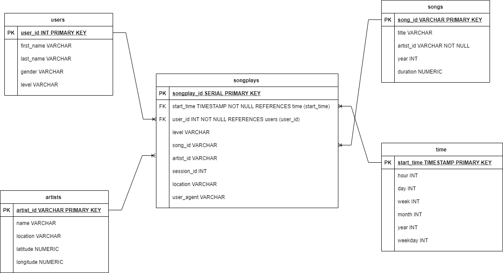

# Project: Data Lake

[Project Rubric](https://review.udacity.com/#!/rubrics/2502/view)

My name is **Phakphoom Claiboon**. Currently, I completed Udacity's Data Engineering Nanodegree, and this is my Data Lake Project of this course.
If you have any comments, please feedback to me.

Thanks.

## Introduction
A music streaming startup, Sparkify, has grown their user base and song database even more and want to move their data warehouse to a data lake. Their data resides in S3, in a directory of JSON logs on user activity on the app, as well as a directory with JSON metadata on the songs in their app.

As their data engineer, you are tasked with building an ETL pipeline that extracts their data from S3, processes them using Spark, and loads the data back into S3 as a set of dimensional tables. This will allow their analytics team to continue finding insights in what songs their users are listening to.

You'll be able to test your database and ETL pipeline by running queries given to you by the analytics team from Sparkify and compare your results with their expected results.

## Project Description
In this project, you'll apply what you've learned on Spark and data lakes to build an ETL pipeline for a data lake hosted on S3. To complete the project, you will need to load data from S3, process the data into analytics tables using Spark, and load them back into S3. You'll deploy this Spark process on a cluster using AWS.

## Summary of the Project
The project need to read many json data and ETL them to build Data Lake modeling
- Design the Data Model
- Reads json data from S3
- ETL processes that data to Data Models/Tables using Spark
- Write the Data Models/Tables to S3 with parquet files

## Schema for Song Play Analysis
Using the song and log datasets, you'll need to create a star schema optimized for queries on song play analysis. This includes the following tables.



### Fact Table
1. **songplays** - records in log data associated with song plays i.e. records with page `NextSong`
    - songplay_id, start_time, user_id, level, song_id, artist_id, session_id, location, user_agent

### Dimension Tables
2. **users** - users in the app
    - user_id, first_name, last_name, gender, level
3. **songs** - songs in music database
    - song_id, title, artist_id, year, duration
4. **artists** - artists in music database
    - artist_id, name, location, latitude, longitude
5. **time** - timestamps of records in **songplays** broken down into specific units
    - start_time, hour, day, week, month, year, weekday

## How to run the Python Scripts

**Run on AWS EMR**
1. Open **dl.cfg**, edit the `AWS_ACCESS_KEY_ID` and `AWS_SECRET_ACCESS_KEY` values in "[AWS]" session with **AWS Access Key ID** and **AWS Secret Access Key**, respectively.

2. Run command to configure the AWS CLI on EMR cluster.

    ``` bash
    export AWS_ACCESS_KEY_ID=<input_your_key_id>
    export AWS_SECRET_ACCESS_KEY=<input_your_access_key>
    ```

3. Open **etl.py**, edit the `output_data` values in main() function with **your S3 URI** for collect the process's output and SAVE it.

4. Create AWS EMR Cluster as following link: 
    - [AWS CLI - Create EMR Cluster](https://classroom.udacity.com/nanodegrees/nd027/parts/e7255be8-71bb-43ea-a1ce-bf7567017d25/modules/a6920c42-85b2-426b-8aa3-3d106e564eae/lessons/52de558c-454f-4d8f-b9e7-8b75515c4c03/concepts/5eb33989-1c12-45be-b108-2a70a4b73c7f)
    - [Udacity: How to execute ETL of Data Lake project on Spark Cluster in AWS?](https://knowledge.udacity.com/questions/46619#552992)

5. Connect the AWS EMR Cluster with SSH as following link : [Connect to the master node using SSH](https://docs.aws.amazon.com/emr/latest/ManagementGuide/emr-connect-master-node-ssh.html)

6. Upload/Create **dl.cfg** and **etl.py** files to EMR Cluster

7. Using sudo, append the following line to the **/etc/spark/conf/spark-env.sh** file: **export PYSPARK_PYTHON=/usr/bin/python3**

8. Run script **etl.py** on the EMR Cluster for start to reads data from S3, processes that data using Spark, and writes them back to S3

    ``` bash
    /home/workspace# which spark-submit
    /usr/bin/spark-submit
    /home/workspace# /usr/bin/spark-submit etl.py
    ```
    
## Remark
You can change **song_data** variable for your purpose as below:

    ``` python
    # For read Full data and Full process
    song_data = input_data + "song_data/*/*/*/*.json"
    
    # For read partial data and Test process
    song_data = input_data + "song_data/A/A/A/*.json"
    ```

## Reference

I have been searching for some ideas or other help to find solutions in my code that are shown as below:
    
1. Idea and Sample for how to read configure file ... [Udacity: I cannot read the dl.cfg file](https://knowledge.udacity.com/questions/368715)
2. Idea and Sample for how to extract zip file ... [Udacity: Data Lake Project - working with smaller datasets found in the workspace](https://knowledge.udacity.com/questions/145486)
3. Idea and Sample for how to write parquet files and partition ...
    - [Udacity: Can someone please tell me what is wrong with this code? I'm unable to execute this.](https://knowledge.udacity.com/questions/678149)
    - [Udacity: Error writing songs table to parquet files; folders get created in the bucket, but still get error](https://knowledge.udacity.com/questions/295862)
    - [Udacity: Data Lake Project 4: No data in songplays table](https://knowledge.udacity.com/questions/742420)
    - [Sparkbyexamples: PySpark Read and Write Parquet File](https://sparkbyexamples.com/pyspark/pyspark-read-and-write-parquet-file/)
    - [Udacity: How to write parquet Songplay table with year and month partition](https://knowledge.udacity.com/questions/60112)
    - [Stackoverflow: Spark: save DataFrame partitioned by "virtual" column](https://stackoverflow.com/questions/35437378/spark-save-dataframe-partitioned-by-virtual-column)
4. Idea and Sample for filter by actions for song plays ... [Udacity: Project 4: Data Lake-# filter by actions for song plays](https://knowledge.udacity.com/questions/105430)
5. Idea and Sample for how to convert and function to Datetime datatype ... 
    - [Udacity: Why I need convert timestamp column to timestamp? (step in project 4)](https://knowledge.udacity.com/questions/536246)
    - [Stackoverflow: How to register UDF with no argument in Pyspark](https://stackoverflow.com/questions/41328702/how-to-register-udf-with-no-argument-in-pyspark)
    - [Stackoverflow: PySpark add a column to a DataFrame from a TimeStampType column](https://stackoverflow.com/questions/30882268/pyspark-add-a-column-to-a-dataframe-from-a-timestamptype-column)
    - [GET HOURS, MINUTES, SECONDS AND MILLISECONDS FROM TIMESTAMP IN PYSPARK](https://www.datasciencemadesimple.com/get-hours-minutes-seconds-and-milliseconds-from-timestamp-in-pyspark/)
    - [pyspark.sql.functions.dayofweek](https://spark.apache.org/docs/latest/api/python/reference/api/pyspark.sql.functions.dayofweek.html)
6. Idea and Sample for how to create column for Auto Increment ... 
    - [Stackoverflow: Auto - Incrementing pyspark dataframe column values](https://stackoverflow.com/questions/50174227/auto-incrementing-pyspark-dataframe-column-values)
    - [Towardsdatascience: Adding sequential IDs to a Spark Dataframe](https://towardsdatascience.com/adding-sequential-ids-to-a-spark-dataframe-fa0df5566ff6)
7. Idea for PySpark Join Types ... [Sparkbyexamples: PySpark Join Types | Join Two DataFrames](https://sparkbyexamples.com/pyspark/pyspark-join-explained-with-examples/)
8. Idea and Sample for aggregate value in PySpark dataframe ... [Stackoverflow: Store aggregate value of a PySpark dataframe column into a variable](https://stackoverflow.com/questions/36987454/store-aggregate-value-of-a-pyspark-dataframe-column-into-a-variable)
9. Idea and Sample for how to execute ETL of Data Lake project ... [Udacity: How to execute ETL of Data Lake project on Spark Cluster in AWS?](https://knowledge.udacity.com/questions/46619#552992)
10. Idea and Sample for issues to read AWS S3 from PySpark ... 
    - [Udacity: S3 AWS Error Message: Forbidden](https://knowledge.udacity.com/questions/137494)
    - [Udacity: Error when trying to access udacity-dend s3a bucket](https://knowledge.udacity.com/questions/369097)
    - [Udacity: Unable to access S3 folders](https://knowledge.udacity.com/questions/374581)
    - [Stackoverflow: Spark 1.6.1 S3 MultiObjectDeleteException](https://stackoverflow.com/questions/38750638/spark-1-6-1-s3-multiobjectdeleteexception)
    - [Udacity: My etl.py cannot access to s3 for read data to testing in the project](https://knowledge.udacity.com/questions/759355)
    - [AWS: Why does my Amazon EMR application fail with an HTTP 403 "Access Denied" AmazonS3Exception?](https://aws.amazon.com/premiumsupport/knowledge-center/emr-s3-403-access-denied/)